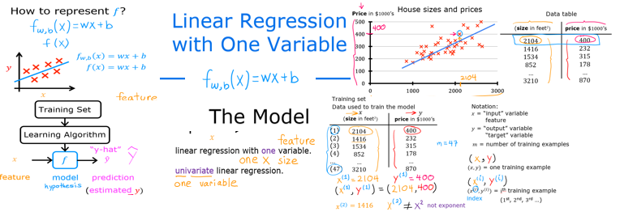

# 机器学习

- 监督学习
- 无监督学习
- 强化学习

## 监督学习

$f(x) = y$

1. 回归算法

2. 分类算法

## 无监督学习

1. 聚类算法(找到相似的特征 进行分组)

2. 异常检测

3. 解降维 （大数据分解）

## 线性回归模型

Here is a summary of some of the notation you will encounter.  

|General     Notation   | Description| Python (if applicable) |
| ----------------------|-------------------------------------------|------|
| $a$ | scalar, non bold                                                      ||
| $\mathbf{a}$ | vector, bold                                                      ||
| **Regression** |         |    |     |
|  $\mathbf{x}$ | Training Example feature values (in this lab - Size (1000 sqft))  | `x_train` |   
|  $\mathbf{y}$  | Training Example  targets (in this lab Price (1000s of dollars)).  | `y_train` 
|  $x^{(i)}$, $y^{(i)}$ | $i_{th}$Training Example | `x_i`, `y_i`|
| m | Number of training examples | `m`|
|  $w$  |  parameter: weight,                                 | `w`    |
|  $b$           |  parameter: bias                                           | `b`    |     
| $f_{w,b}(x^{(i)})$ | The result of the model evaluation at $x^{(i)}$ parameterized by $w,b$: $f_{w,b}(x^{(i)}) = wx^{(i)}+b$  | `f_wb` | 

- 回归模型
  - 线性回归模型

- 分类模型
  - 分类问题(离散数据)

$x$ ==> input

$y$ ==> output target

m ==> 训练数据数量

(x,y) sing traning example

*next*

traning set == features targets

learning algorithm 学习资产

$x^{(i)}$, $y^{(i)}$

x ==> f ==> y^

feature mode prediction

<!-- fw_b(x) = wx + b -->

$w,b$: $f_{w,b}(x^{(i)}) = wx^{(i)}

非线性回归

线性回归

一个变量的线性回归模型

单变量线性回归模型

## 成本函数

平方误差函数 常用于线性回归

平方误差和 $$\sum\limits_{i = 0}^{m-1} (f_{w,b}(x^{(i)}) - y^{(i)})^2 \tag{1}$$

成本函数 $$J(w,b) = \frac{1}{2m} \sum\limits_{i = 0}^{m-1} (f_{w,b}(x^{(i)}) - y^{(i)})^2 \tag{1}$$

where 

  $$f_{w,b}(x^{(i)}) = wx^{(i)} + b \tag{2}$$

实现:

